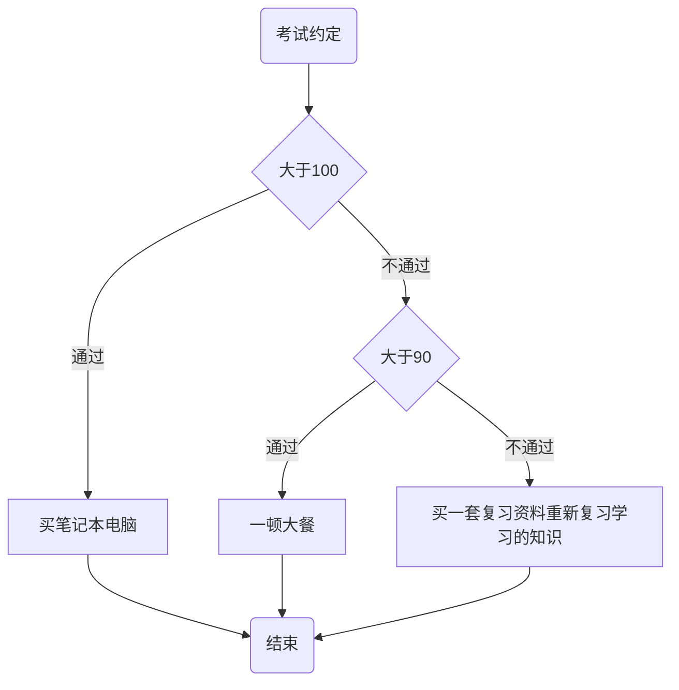

# 第5章 - 如何给你们程序增加简单的智能

我们人类每天都生活在各种各样的判断选择中，从小就开始学习和认识各种判断条件以进行人生的选择，比如要好好学习、上课要认真、不要做坏事等等，这些全部都是判断的条件。

程序也一样，要想你的程序变的更聪明，就要使你的程序能够理解条件判断语句。

### 什么是条件判断语句

在实际生活中，爸爸妈妈会经常和我们说：

- 如果你这次考试得了满分，就奖励你干嘛干嘛
- 如果你今天表现的很棒，就送你个什么什么
- 如果你在公园和爸爸妈妈走丢了，就要站在原地等爸爸妈妈找回来
- 等等

这些带上条件判断的语句，就是条件判断语句。

***以一次考试成绩为例，中文表示如下：***

妈妈说：

如果你这次考试考了 100 分，我就奖励你一台笔记本电脑

否则 如果你考试考了 90 分以上，我就奖励你一顿套餐

否则 给你买一套复习资料重新复习学习的知识

***流程图表示如下：***



***C++代码表示如下：***
```c++
int i;

cout << "请输入你的成绩" << endl;
cin >> i;

if(i == 100) {
    cout << "买笔记本电脑" << endl;
} else if(i >= 90) {
    cout << "一顿大餐" << endl;
} else {
    cout << "买一套复习资料重新复习学习的知识" << endl;
}
```

***解释：***
- if 就是程序里面的“如果”，用于判断
- (i >= 100) 这个括号里面的内容就是判断条件，用来判断条件是否满足
- {} 里面的内容就是要做的事，如果条件满足即条件为真就会执行里面的代码
- else 就是程序里面的“否则”，用于判断条件不满足即条件为假的情况下去做一些事情

### 魔法符号之关系运算符

通过前面我们可以知道，条件判断语句里面，是通过一种特殊符号来判断条件是否满足，这个符号关系运算符。

#### 双胞胎符号 `==`

双胞胎符号 `==`，表示判断两边是否相等，如果相等就表示条件为真，如果不相等就表示条件为假。和数学里面的等号 `=` 一样，表示判断两边是否相等。

#### 大嘴巴怪兽 `>` `<`

`>` 大于号，表示判断左边是否大于右边，如果大于就表示条件为真，如果不大于就表示条件为假。

`<` 小于号，表示判断左边是否小于右边，如果小于就表示条件为真，如果不小于就表示条件为假。

#### 双胞胎怪兽 `>=` `<=`

`>=` 大于等于号，表示判断左边是否大于等于右边，如果大于等于就表示条件为真，如果不大于等于就表示条件为假。

`<=` 小于等于号，表示判断左边是否小于等于右边，如果小于等于就表示条件为真，如果不小于等于就表示条件为假。

#### 不等于小淘气 `!=`

`!=` 不等于号，表示判断左边是否不等于右边，如果不等于就表示条件为真，如果不不等于就表示条件为假。


> 注意点
> - C++里面一个等于号是赋值运算符，两个连续的等号才是关系运算符，用于判断两边的条件是否相等
> - 注意6种关系运算符的判断关系
> - 否则后面可以再跟一个如果用来判断下一个条件是否满足，示例：else if(i >= 90)
> - 注意设定判断条件的时候，要考虑清楚各条件是否会满足，不要设定不能满足的条件，否则判断条件会失效


## 强化练习

### 阅读以下代码，写出程序的输出结果

```c++
int a = 5;
if(a == 5) {
    cout << "我走这里" << endl;
} else if(a > 6) {
    cout << "你走这里" << endl;
} else if(a < 4) {
    cout << "他走这里" << endl;
}

```

### 实现变量交换

- 创建两个整形变量，用来存用用户输入的数字
- 判断两个变量的大小，输出大的那个变量的值