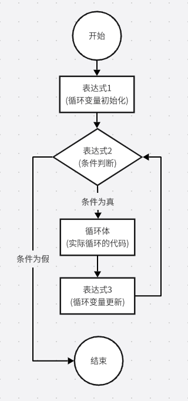
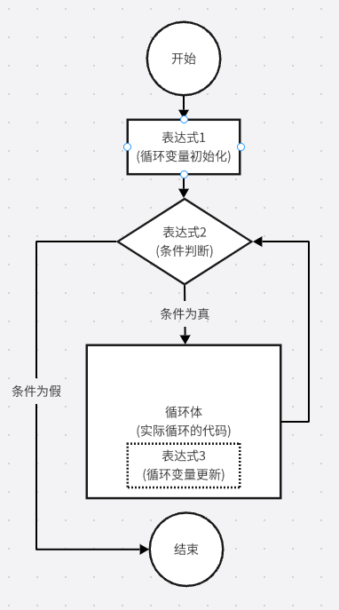
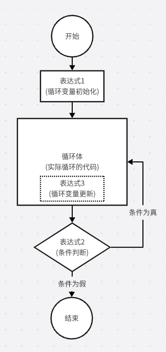

# 第7章 - 认识循环的魔法咒语

前面我们学习了如何增程序增加智能效果，这样程序就有了自己的判断能力，可以根据不同的条件走到不同的分支里面去。但是，有没发现我们的程序每次都只能执行一次呢？执行完了就结束了，只能一个顺序跑下去。那如何让程序可以一直执行呢？

比如我们要设定一个闹钟，这个闹钟要在每天早上六点钟响起，以便我们能准时起床去跑步。这个在程序里面怎么处理呢？

### 什么是循环？

在我们的日常生活中，循环无处不在，就像一个看不见的指挥家，让世界按照一定的节奏运转。

- 四季更替：春夏秋冬，周而复始，这是地球绕太阳公转的结果。就像一个永不停歇的循环，每个季节都有自己的特点和变化。
- 昼夜交替：太阳东升西落，白天黑夜交替出现，这是地球自转的结果。每天都在重复这个循环，让我们的生活有了规律。
- 水的循环：水蒸发、凝结、降水，不断循环，滋润着地球上的生命。这是一个庞大而复杂的循环系统，维持着地球的生态平衡。
- 月亮的阴晴圆缺：月亮围绕地球旋转，人们也观察到月亮随着时间会出现不同的形状，阴晴圆缺，这也是一个循环。

在计算机程序中，循环（loop）也是一个重要概念，它允许程序重复执行一段代码，直到满足某些条件为止。

#### for循环：按次数重复的“魔法咒语”

for循环就像是一个“计数器”，它可以按照我们设定的次数，重复执行一段代码。

比如：
- “我要拍5次手。”

***for 循环的标准语法：***

for(表达式1; 表达式2; 表达式3) {

    循环体

}

***for 循环对应流程图：***



- 表达式1：初始化循环变量，设置循环变量的初始值，如int a = 0 表示初始化循环变量a为0。
- 表达式2：条件判断，用于判断循环是否继续，如 a < 5 表示循环5次，从0开始，到4结束。
- 表达式3：循环增量，用于更新循环变量的值，如 a++ 表示每次循环完，a加1。
- 循环体：就是循环执行的代码块，可以是一个语句，也可以是多个语句，用英文 `{` 开头，用英文 `}` 结束包括起来的代码块，表示循环体。

***代码示例：***
```c++
cout << "开始拍手" << endl;
for(int a = 0; a < 5; a++) {
    cout << "拍手第 " << a << " 次" << endl;
}
cout << "结束拍手" << endl;
```

#### while循环：按条件重复的“魔法咒语”

在日常生活中，while 循环的应用非常广泛，它就像一个不知疲倦的“守门员”，时刻检查着条件是否满足，并决定是否继续执行。

比如自动售货机在工作时，会使用 while 循环来等待用户投入足够的硬币。只要投入的金额小于商品的价格，售货机就会一直等待。当投入的金额达到或超过商品的价格时，循环结束，售货机才会吐出商品。

还有我们玩的飞机游戏，只要玩家一直按下发射键，就会一直发射子弹。直到玩家松开发射键，子弹就会停止发射。

***while 循环的标准语法：***

表达式1;

while(表达式2) {

    循环体

    表达式3

}

***while 循环对应流程图：***



***代码示例：***

```c++

cout << "开始拍手" << endl;
int a = 0;
while(a < 5) {
    cout << "拍手第 " << a << " 次" << endl;
    a++;
}
cout << "结束拍手" << endl;

```

#### do...while循环：先执行后判断的“魔法咒语”

我们经常会遇到一个场景，就是我们想吃啥零食的时候，会先试吃一下，好吃就买来吃，不好吃就不买了。这就是一个do ... while 循环场景。

***while 循环的标准语法：***

表达式1;

do {

    循环体

    表达式3

} while(表达式2)

***do ... while 循环对应流程图：***



***代码示例：***

```c++

cout << "开始拍手" << endl;
int a = 0;
do {
    cout << "拍手第 " << a << " 次" << endl;
    a++;
} while(a < 5)
cout << "结束拍手" << endl;

```

#### 三种循环魔法咒语的特点

for 循环：已知循环次数。
while 循环：循环次数未知，但循环条件明确，先判断后执行。
do...while 循环：循环体至少执行一次，先执行后判断。

### 注意点

- while和do...while需要在循环体中手动更新循环变量的值，否则可能会死循环。
- 当你不知道要循环多少次时，使用while循环。
- 当你不确定循环次数时但最少要执行一次时，使用do...while循环。
- 当你确定执行次数时，使用for循环。


## 强化练习

### 使用 for 循环打印数字序列

编写一个程序，使用 for 循环打印从 1 到 10 的所有整数。

### 使用 while 循环计算数字之和

编写一个程序，让用户输入一系列整数，直到输入 0 为止。
- 每次输入一个数字，并累加之前的数字之和
- 当输入 0 时，打印出之前所有输入数字之和，并退出程序

### 使用 do ... while 循环输入验证

编写一个程序，要求用户输入一个 1 到 10 之间的整数。
- 要求用户输入一个数字
- 验证输入的数字是否在 1 到 10 之间，如果不在，要求用户重新输入
- 当输入 1 到 10 之间的数字时，打印出输入的数字，并退出程序
